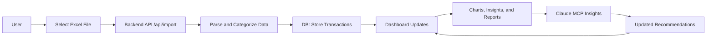

Perfect — here’s the **enhanced Markdown document** (`PROJECT_BRIEF.md`) with **Mermaid diagrams** added for the architecture, data flow, and system components.
The diagrams are optimized for readability in GitHub, GitLab, and MkDocs renderers.

---

````markdown
# Personal Finance Analysis Service  
_A privacy-first local finance insight tool powered by Claude and MCP_

---

## 1. Project Overview

This project builds a **local personal finance analysis service** that helps users understand their spending habits from **Santander Excel statements**.  

Users place monthly `.xlsx` statement files in a designated local folder.  
The system:
- Parses the Santander-specific structure
- Categorizes spending by type (e.g., groceries, transport)
- Provides visual insights through a web dashboard
- Uses **Claude via MCP** to suggest categories and identify saving opportunities

---

## 2. Objectives

- Provide **clear insights** into personal spending trends  
- Enable **local, privacy-preserving** financial analysis  
- Use **AI-assisted classification** to improve accuracy  
- Offer a **modern, responsive web dashboard**  

---

## 3. Key Features

| Area | Description |
|------|--------------|
| **Data Input** | Reads `.xlsx` statement files from a local folder. Supports Santander’s column structure (date, description, debit, credit, balance). |
| **File Browser** | Web interface lists available Excel files and import status. |
| **Parsing** | Extracts transactions, normalizes numeric formats, and loads into SQLite or DuckDB. |
| **Categorization** | Uses rule-based and AI-assisted classification. |
| **Analysis** | Generates trends, top categories, recurring merchants, and savings opportunities. |
| **Visualization** | Frontend charts for monthly breakdowns, categories, and total spend. |
| **UI** | Built with **Tailwind CSS** and **daisyUI**. |

---

## 4. Technical Architecture

### 4.1 System Overview

```mermaid
graph TD
    subgraph UI["Web Frontend (React + Tailwind + daisyUI)"]
        A1[File Browser]
        A2[Dashboard / Charts]
        A3[Insights Panel]
    end

    subgraph API["Local Backend Service (Go/Python)"]
        B1[file_manager (MCP)]
        B2[excel_parser (MCP)]
        B3[categorizer (MCP)]
        B4[analytics_engine (MCP)]
        B5[ui_server]
    end

    subgraph Claude["Claude via MCP"]
        C1[AI Categorization & Insights]
    end

    subgraph FS["Local File System"]
        D1[Excel Folder ~/FinanceData/]
        D2[SQLite / DuckDB]
    end

    A1 -->|List & Import| B1
    A2 -->|Fetch Summary| B4
    A3 -->|AI Insights| C1
    B1 -->|Scan Files| D1
    B2 -->|Parse Excel| D1
    B3 -->|Categorize| D2
    B4 -->|Trends & Reports| D2
    C1 -->|Suggest Categories| B3
    B5 -->|Serve API & UI| A1
````

---

### 4.2 MCP Components

| MCP Component      | Capability                                            | Description                                                |
| ------------------ | ----------------------------------------------------- | ---------------------------------------------------------- |
| `excel_parser`     | `parse_excel(file_path)`                              | Parses Santander Excel files into normalized transactions. |
| `file_manager`     | `list_excel_files()`, `get_file_metadata(file_name)`  | Scans the local data folder for available Excel files.     |
| `categorizer`      | `categorize_transactions(data)`                       | Applies rule-based and AI-assisted classification.         |
| `analytics_engine` | `compute_trends(period)`, `generate_summary_report()` | Aggregates and summarizes transactions.                    |
| `ui_server`        | `serve_dashboard()`, `api_get_data()`                 | Serves frontend and API endpoints.                         |

---

### 4.3 Data Flow

```mermaid
sequenceDiagram
    participant User
    participant UI as Web UI
    participant API as Backend API
    participant Parser as excel_parser (MCP)
    participant Categorizer as categorizer (MCP)
    participant Claude as Claude (MCP)
    participant DB as SQLite/DuckDB

    User->>UI: Open Dashboard
    UI->>API: GET /api/files
    API->>DB: Check imported files
    API-->>UI: List of files + status

    User->>UI: Import "2025-07-santander.xlsx"
    UI->>API: POST /api/import
    API->>Parser: parse_excel(file)
    Parser->>DB: Insert transactions
    API-->>UI: Import complete

    API->>Categorizer: categorize_transactions(data)
    Categorizer->>Claude: AI suggestions (for unknowns)
    Claude-->>Categorizer: Category assignments
    Categorizer->>DB: Store categories

    UI->>API: GET /api/summary
    API->>DB: Compute analytics
    API-->>UI: Spending trends + insights
    UI-->>User: Render charts and reports
```

---

### 4.4 Data Model (SQLite / DuckDB)

**Table: `transactions`**

| Column      | Type    | Description                                |
| ----------- | ------- | ------------------------------------------ |
| id          | INTEGER | Primary key                                |
| date        | DATE    | Transaction date                           |
| description | TEXT    | Original transaction text                  |
| amount      | REAL    | Positive for income, negative for expenses |
| category    | TEXT    | Spending category                          |
| source_file | TEXT    | Excel file name                            |
| merchant    | TEXT    | Extracted merchant name                    |

**Table: `categories`**

| Column       | Type    | Description           |
| ------------ | ------- | --------------------- |
| name         | TEXT    | Category name         |
| rule_pattern | TEXT    | Regex or keyword rule |
| ai_suggested | BOOLEAN | AI-created rule       |

---

### 4.5 API Schema (REST)

| Endpoint          | Method | Description                            |
| ----------------- | ------ | -------------------------------------- |
| `/api/files`      | GET    | List available Excel files             |
| `/api/import`     | POST   | Parse and import a selected Excel file |
| `/api/categories` | GET    | Return all categories and rules        |
| `/api/summary`    | GET    | Aggregated spending summary            |
| `/api/trends`     | GET    | Timeseries spending data               |

---

## 5. Frontend Design

* **Framework:** React + Vite
* **Styling:** Tailwind CSS + daisyUI
* **Main Views:**

  * Dashboard (spending summary, charts)
  * Transactions (table with category editing)
  * Files (available Excel data)
  * Insights (Claude-generated saving suggestions)

**Example Components**

* `<FileList />` – lists `.xlsx` files and import status
* `<SpendingChart />` – visualizes monthly spend
* `<CategoryBreakdown />` – pie chart by category
* `<InsightsPanel />` – AI-generated suggestions

---

### 5.1 Frontend Interaction Flow



---

## 6. Claude Integration via MCP

Claude is used for **AI-assisted categorization** and **financial insight generation**.

### Example Categorization Workflow

1. `categorizer` identifies ambiguous transactions
2. Calls Claude MCP with:

   ```json
   {
     "transaction": "TESCO STORES 1234",
     "amount": -42.75,
     "date": "2025-07-05"
   }
   ```
3. Claude responds:

   ```json
   {
     "category": "Groceries",
     "confidence": 0.93
   }
   ```
4. Result stored in the DB and visible in the UI.

### Example Insight

> “Your average grocery spending in the past 3 months increased by 12%. You could save ~£45/month by reducing supermarket frequency.”

---

## 7. Security & Privacy

* All operations are **local** — no cloud upload.
* Claude interactions limited to anonymized text and numeric data.
* Optional offline mode (AI disabled).
* User data stored securely in SQLite.

---

## 8. Future Extensions

* Add support for Santander PDF or CSV formats
* Integrate multiple banks
* Budget and goal tracking
* Encrypted data store
* Export reports to PDF or CSV

---

## 9. Development Plan

| Phase | Deliverable        | Description                                 |
| ----- | ------------------ | ------------------------------------------- |
| 1     | MCP Scaffolding    | Define component interfaces                 |
| 2     | Excel Parsing      | Implement Santander format parser           |
| 3     | Categorization     | Add rule and AI-based classification        |
| 4     | Web UI             | Build React + Tailwind dashboard            |
| 5     | Claude Integration | Enable MCP for AI categorization            |
| 6     | Insights           | Add savings and recurring expense analytics |
| 7     | Polish             | Finalize docs, Dockerfile, and installer    |

---

## 10. Repository Structure

```
finance-analyzer/
│
├── backend/
│   ├── main.go / app.py
│   ├── mcp/
│   │   ├── excel_parser.go
│   │   ├── categorizer.go
│   │   ├── analytics_engine.go
│   │   └── file_manager.go
│   ├── db/
│   │   └── migrations.sql
│   └── api/
│       ├── handlers.go
│       └── routes.go
│
├── frontend/
│   ├── src/
│   │   ├── components/
│   │   ├── pages/
│   │   ├── App.jsx
│   │   └── index.jsx
│   └── tailwind.config.js
│
├── data/
│   └── FinanceData/   # local Excel files
│
├── docs/
│   └── PROJECT_BRIEF.md
│
└── README.md
```

---

## 11. Expected Outcome

By project completion, users will have a **local dashboard** to:

* Import Santander Excel statements
* Explore categorized spending trends
* Receive AI-driven insights for savings
* Operate entirely offline with full data control
